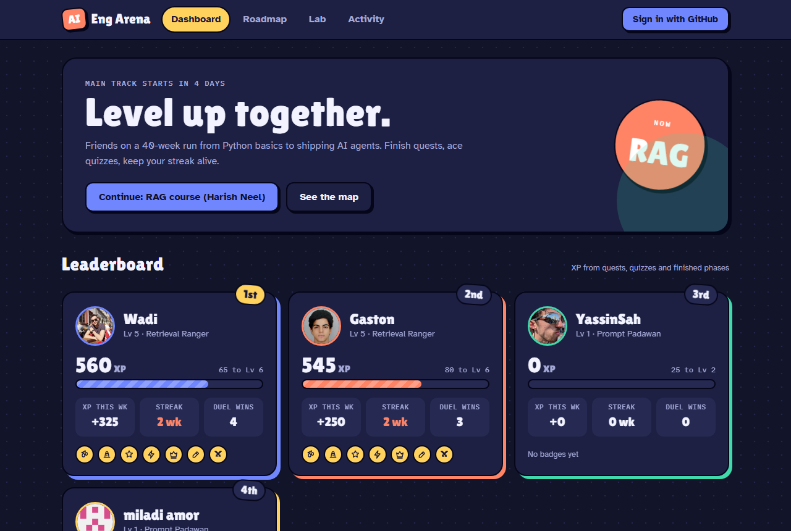
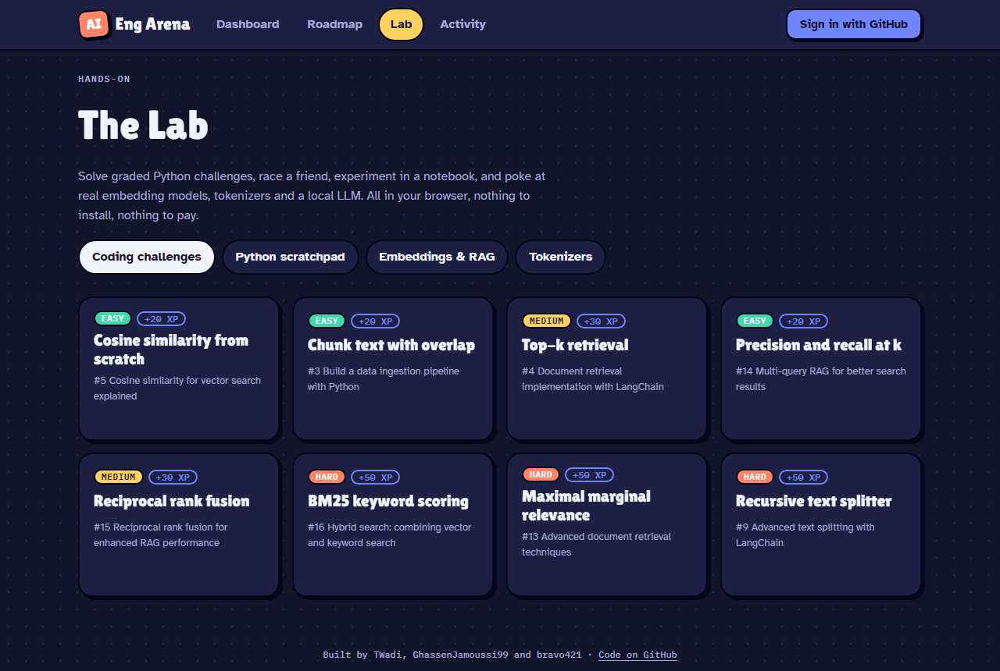
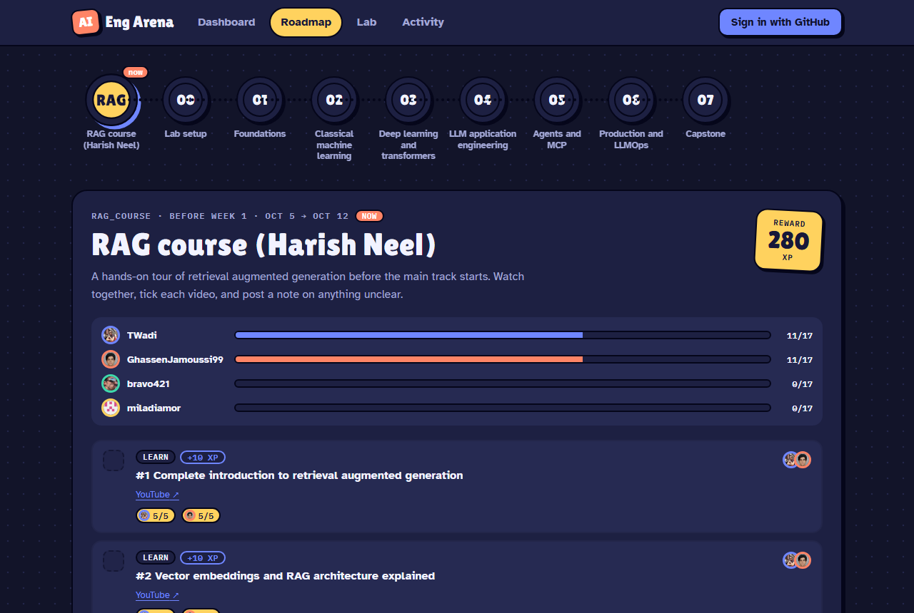

# AI Engineering Arena

**Two friends learning AI engineering, and the game we built to keep each other going.**

👉 **Live:** https://twadi.github.io/ai-engineering-arena/



## Our story

In October 2026, [Wadi](https://github.com/TWadi) and [Ghassen](https://github.com/GhassenJamoussi99) decided to stop *talking* about learning AI engineering and actually do it, together. We set ourselves a 40-week path, from Python foundations all the way to shipping production LLM apps and agents.

We know how self-study usually goes: a strong first week, then life gets in the way. So we made it a game. Every lecture we finish earns XP. Quizzes have to be passed before a lecture counts. You can challenge your friend to a live quiz duel the moment you both finish a video. Then we kept adding things: code races, a Python lab in the browser, tokenizers, a tiny LLM running locally...

What started as a progress tracker turned into a small learning platform. This repo is both: **our actual learning journey** (notes, notebooks and projects for every phase) and **the arena we built around it**. We're sharing it in case it helps someone else learn with a friend, and because building it taught us almost as much as the courses did.

Friends are welcome to join: sign in with GitHub, and one of us lets you in.

## What's inside the arena

### Level up together
- **XP, levels and titles**, from *Prompt Padawan* to *Lab Legend*.
- **Badges and streaks**: hat tricks, perfect quizzes, phase finishers.
- **A live leaderboard.**
- **Activity feed** so you see the moment your friend finishes something (and feel the pressure).
- **Profiles** with an XP-over-time chart and **share cards** you can post when you level up.

### Learn, then prove it
- **The roadmap:** a RAG warm-up course, then 8 phases over 40 weeks, each with lectures, reading and a project to ship.
- **Quizzes for every lecture**, drawn from our own question bank and graded on the server (no peeking at answers).
- **A lecture only counts once you pass its quiz** (4/5 or better). Passing ticks it for you.

### Compete
- **Live quiz duels:** challenge a friend, they get a notification, and once they accept you both get the same 5 questions on a 2-minute clock. Best score wins, ties go to the faster player. A duel also counts as your quiz.
- **Code races:** a random coding challenge, revealed to both of you at the same moment. First to pass every test wins, then you compare each other's code.

### The Lab: hands-on, all in the browser, all free


- **Coding challenges** (cosine similarity, chunking, BM25, reciprocal rank fusion, MMR…), graded instantly by real Python running in your browser ([Pyodide](https://pyodide.org)).
- **Python scratchpad:** a mini notebook with numpy, pandas, matplotlib and scikit-learn.
- **Embeddings & RAG:**
  - Embed sentences and see them on a 2D map.
  - Chunk a document and retrieve the chunks that match a question.
  - Watch **a small LLM running on your own GPU** write the answer from those chunks ([transformers.js](https://huggingface.co/docs/transformers.js)).
- **Tokenizers:** see how GPT-4o, GPT-2, BERT, T5 and others chop up the same text.



## The learning path

| # | Phase | Weeks | What we ship |
|---|-------|-------|--------------|
| – | [RAG warm-up course](rag-course/) | before week 1 | Notes and quizzes on 17 videos |
| 0 | [Setup](00-setup/) | 1 | Repo live, first reviewed PRs |
| 1 | [Foundations](01-foundations/) | 2–5 | Tested Python CLI + analysis notebook |
| 2 | [Classical ML](02-classical-ml/) | 6–10 | Kaggle submission + model comparison |
| 3 | [Deep learning](03-deep-learning/) | 11–17 | A tiny GPT trained on our own corpus |
| 4 | [LLM apps](04-llm-apps/) | 18–24 | RAG app over our lecture PDFs + evals |
| 5 | [Agents & MCP](05-agents-mcp/) | 25–29 | An agent using our own MCP server |
| 6 | [Production](06-production/) | 30–34 | Deployed app with CI evals and cost dashboard |
| 7 | [Capstone](07-capstone/) | 35–40 | Public capstone, demo and write-up |

## Built with (and 100% free to run)

- **Site:** React + TypeScript + Vite, hosted on GitHub Pages.
- **Backend:** Supabase.
  - Postgres with row-level security.
  - Realtime for duels and the live feed.
  - GitHub sign-in.
  - Quizzes, duels and races are graded and decided in the database, so nobody can fake a score.
- **In-browser AI and Python:**
  - Pyodide for Python.
  - transformers.js for embeddings, tokenizers and a local Qwen2.5 LLM.
  - No paid APIs, no API keys.
- **CI:** GitHub Actions runs the Python tests, checks every coding challenge against its reference solution, then tests and builds the site.

## Repo layout

```
ai-engineering-arena/
├── rag-course/, 00-setup/ … 07-capstone/
│   ├── README.md            goal, checklist and ship criteria for the phase
│   └── <github-username>/   each person's own notebooks and code
├── shared/                  Python code we both reuse (with tests)
├── site/                    the arena website (React + Supabase)
│   └── challenges/          coding challenges, written in Python with reference solutions
├── supabase/                database migrations and the quiz question bank
├── tests/                   tests for shared/, run in CI on every PR
└── pyproject.toml           Python dependencies, managed with uv
```

## Run it yourself

Learning environment:

```bash
git clone https://github.com/TWadi/ai-engineering-arena.git
cd ai-engineering-arena
uv sync                      # creates .venv and installs everything
cp .env.example .env         # then fill in your own keys
uv run python 00-setup/check_env.py
uv run pytest
```

The website (see [site/README.md](site/README.md) for connecting your own Supabase project):

```bash
cd site
npm ci
npm run dev                  # http://localhost:5173/ai-engineering-arena/
```

## How we work

Branch per piece of work, one review from the other before merging, and a weekly rhythm of solo deep work plus a pair session. See [CONTRIBUTING.md](CONTRIBUTING.md).

---

Started by [Wadi](https://github.com/TWadi) and [Ghassen](https://github.com/GhassenJamoussi99), with [Yassine](https://github.com/bravo421) joining along the way. If you learn with a friend using this, we'd love to hear about it.
