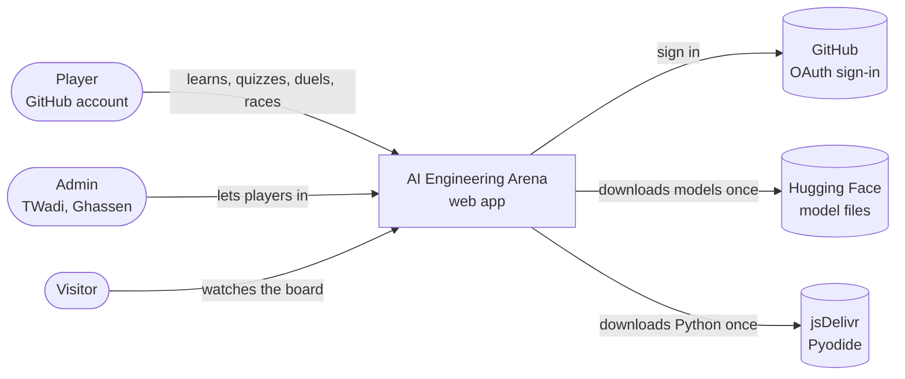
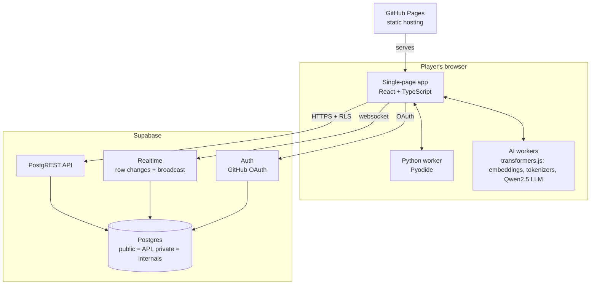
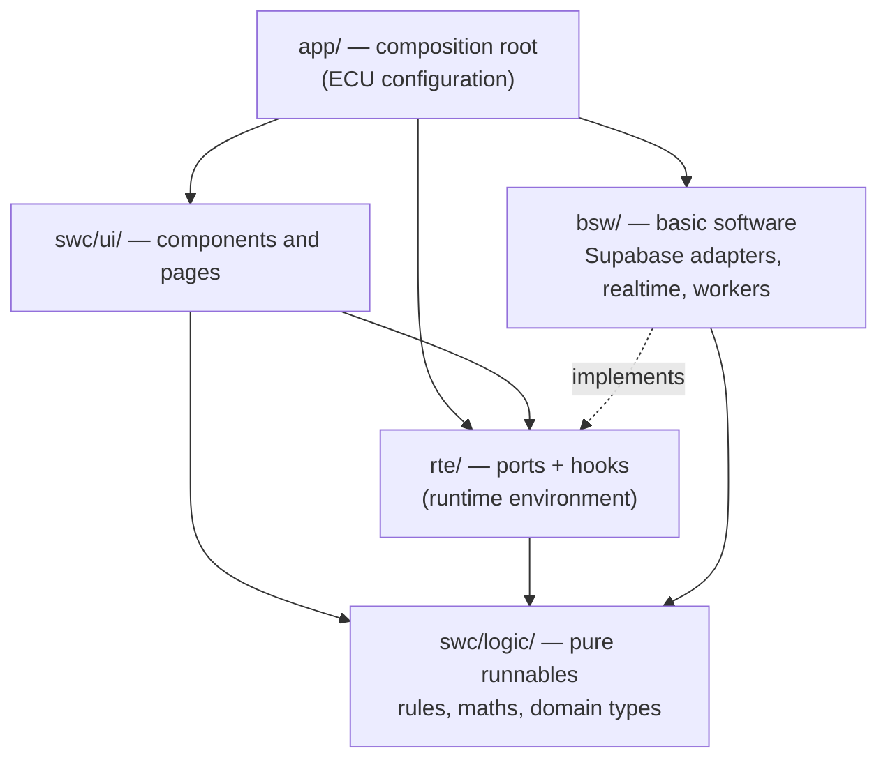
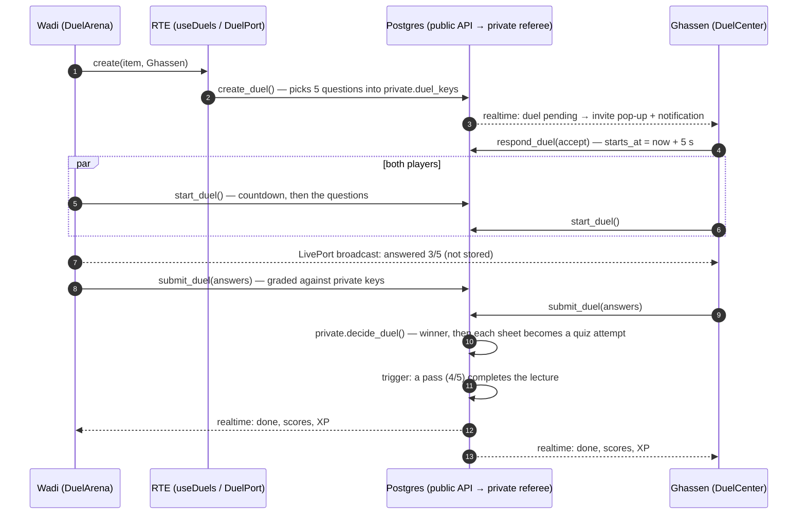
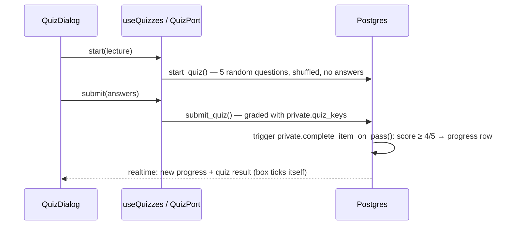

# Software architecture

AI Engineering Arena is a single-page web app (React + TypeScript, served by GitHub Pages) on top of a Supabase backend (Postgres with row-level security, realtime and GitHub sign-in). Python and AI models run **in the browser**, in Web Workers. Nothing costs money to run.

The frontend follows an **AUTOSAR-style layered architecture**:
- **Application software components (SWC)** never talk to infrastructure directly.
- They go through a **runtime environment (RTE)** of typed ports.
- The ports are implemented by the **basic software (BSW)**.

The same idea is applied to the database ([database.md](database.md)).

- [1. System context](#1-system-context)
- [2. Containers](#2-containers)
- [3. Frontend layers](#3-frontend-layers)
- [4. The RTE: ports](#4-the-rte-ports)
- [5. Key flows](#5-key-flows)
- [6. How the rules are enforced](#6-how-the-rules-are-enforced)
- [7. Testing strategy](#7-testing-strategy)
- [8. Adding a feature](#8-adding-a-feature)
- [Decision records](adr/)

## 1. System context

## 2. Containers

Every rule that matters runs in the database:
- Grading.
- The duel clock.
- Who may tick what.
- Who is an admin.

The browser can display results, but it can't fake them.

## 3. Frontend layers

| Layer | Folder | Responsibility | May import |
|---|---|---|---|
| Composition root | `site/src/app/` | Builds the one `Rte` instance (`createRte()`) and mounts the app inside `<RteProvider>` | everything |
| Application components | `site/src/swc/ui/` | Pages and components; state via RTE hooks | `swc/logic`, `rte` |
| Runnables | `site/src/swc/logic/` | Pure rules: XP, levels, badges, duel views, quiz pass mark, routing, vector maths, domain types | nothing outside `swc/logic` (no React, no Supabase) |
| RTE | `site/src/rte/` | Port interfaces (`ports.ts`), `RteProvider`/`useRte`, hooks that turn ports into React state | `swc/logic` |
| Basic software | `site/src/bsw/` | Supabase adapters, realtime channels, offline ports, Pyodide and model workers | `swc/logic`, `rte` (to implement ports) |

## 4. The RTE: ports

All ports are defined in [`site/src/rte/ports.ts`](../site/src/rte/ports.ts). Like AUTOSAR ports, there are two kinds:

- **Sender/Receiver:** `load…()` returns the current value, and `watch…()` delivers changes pushed later (realtime). Each returns an `Unsubscribe`.
- **Client/Server:** operations returning `Outcome<T>`, which is either `{ ok: true, value }` or `{ ok: false, error }`. The error is already a message meant for the player; raw database errors never reach the UI.

| Port | Sender/Receiver | Client/Server | Implemented in |
|---|---|---|---|
| `AuthPort` | session, own profile | sign in/out | `bsw/supabase/auth.ts` |
| `ProgressPort` | players, progress | `markDone` | `bsw/supabase/progress.ts` |
| `QuizPort` | results, quiz items | `start`, `submit` | `bsw/supabase/quizzes.ts` |
| `DuelPort` | duels, entries, race solutions | `create`, `createRace`, `respond`, `cancel`, `start`, `submit`, `submitRace`, `finish` | `bsw/supabase/duels.ts` |
| `LivePort` | live duel progress (broadcast, never stored) | `send` | `bsw/supabase/duels.ts` |
| `PlayersPort` | admin overview | `invite`, `remove`, `decline` | `bsw/supabase/players.ts` |
| `SolvesPort` | challenge solves | `record` | `bsw/supabase/solves.ts` |
| `PythonPort`, `KernelPort` | — | run challenge tests, run notebook cells | `bsw/compute/` (Pyodide workers) |
| `EmbedPort`, `TokenizerPort`, `LlmPort` | — | embed, tokenize, generate | `bsw/compute/` (transformers.js workers) |

Without database settings, `createRte()` wires `bsw/offline.ts` instead: reads come back empty and every action explains why.

## 5. Key flows

### A live quiz duel

### Passing a quiz completes a lecture

## 6. How the rules are enforced

| Rule | Enforced by |
|---|---|
| Layer directions, no cycles, Supabase only in `bsw/`, no orphan modules | [`site/.dependency-cruiser.cjs`](../site/.dependency-cruiser.cjs) (`npm run lint:arch`), run in CI |
| Types are sound across layers | `tsc -b` (strict), run in CI |
| Database API surface is exactly the intended ports | [`supabase/tests/70_api_surface.sql`](../supabase/tests/70_api_surface.sql), run in CI |
| Every migration replays from scratch | `supabase/tests/run.sh`, run in CI |
| Coding challenges are solvable and their starters fail | `site/challenges/build.py`, run in CI |

A violation fails the pull request.

## 7. Testing strategy

| Level | What | Where |
|---|---|---|
| Unit (pure) | XP, levels, badges, duel views, feed, routing, vectors, share cards | `site/src/swc/logic/**/*.test.ts` |
| RTE with fake ports | hooks driven by in-memory ports, no database | `site/src/rte/rte.test.tsx` |
| Database | sign-up, security, quizzes and progress gating, duels, races, players, solves, API contract | `supabase/tests/*.sql` on a fresh Postgres 15 with a Supabase shim |
| Content | every coding challenge's reference solution passes and its starter fails | `site/challenges/build.py` |
| Python | `shared/` package | `tests/` (pytest) |

## 8. Adding a feature

1. **Rules first:** put the pure logic and its types in `swc/logic/`, with unit tests.
2. **Database:** if the feature needs the database, add a migration. Secrets and helpers go in `private`. Expose only what the site calls in `public`, and update `70_api_surface.sql` in the same PR. Add SQL tests.
3. **Port:** add or extend a port in `rte/ports.ts`, then implement it in `bsw/` (and in `bsw/offline.ts`).
4. **Hook:** add an RTE hook if the UI needs state.
5. **UI:** build the component in `swc/ui/` using the hook or `useRte()`.
6. **Check:** `npm run lint:arch && npm test && npx tsc -b`, and `supabase/tests/run.sh` for database changes.
