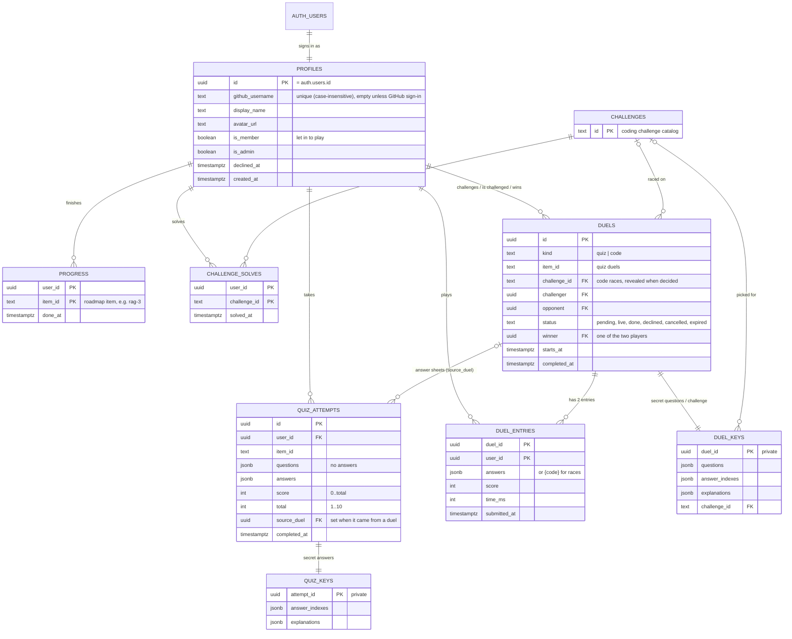

# Database schema

Supabase Postgres. The schema is built only by the migrations in [`supabase/migrations/`](../supabase/migrations/), applied in filename order. CI replays all of them on a fresh database and runs the SQL test suite on every pull request (see [Testing](#testing)).

- [1. Two schemas: API and internals](#1-two-schemas-api-and-internals)
- [2. Entity-relationship diagram](#2-entity-relationship-diagram)
- [3. Tables](#3-tables)
- [4. The API: functions the site calls](#4-the-api-functions-the-site-calls)
- [5. Internals](#5-internals)
- [6. Security model](#6-security-model)
- [7. Realtime](#7-realtime)
- [Testing](#testing)
- [Changing the schema](#changing-the-schema)

## 1. Two schemas: API and internals

The database follows the same idea as the frontend's RTE: everything the website may touch is a declared **port**, and everything else is hidden.

| Schema | Role | Visible to the Supabase API? | Contents |
|---|---|---|---|
| `public` | **API / ports** | yes, under row-level security | the tables the site reads, and the 15 functions it may call |
| `private` | **internals** | no, the API doesn't know it exists | answer keys, question bank, member/admin lists, the duel referee, triggers, RLS predicates, settings |

```mermaid
flowchart LR
  site[Website<br/>anon / authenticated role] -->|select under RLS| pubT[public tables]
  site -->|rpc| pubF[public functions<br/>security definer]
  pubF --> privT[private tables<br/>keys, bank, members]
  pubF --> privF[private referee,<br/>settings, helpers]
  trig[triggers] --> privF
  site -. no access .-x privT
```



## 2. Entity-relationship diagram



Also in `private`, with no relationships:
- `members (github_username)` and `admins (github_username)`: the allow-lists. Usernames are unique, case-insensitively.
- `quiz_bank (id, item_id, question, options[4], answer_index, explanation)`: 136 questions, 8 per RAG lecture.

## 3. Tables

| Table | Schema | Purpose | Who can read | Who can write |
|---|---|---|---|---|
| `profiles` | public | one per signed-in GitHub user | everyone sees players; users see their own | sign-up trigger; admin functions |
| `progress` | public | finished roadmap items | everyone | players insert their own (only after passing the quiz, if the item has one); never delete |
| `quiz_attempts` | public | quiz results (solo and from duels) | finished ones: everyone, except duel sheets, which stay hidden until the duel is decided; open ones: the owner | quiz and duel functions |
| `duels` | public | quiz duels and code races | everyone | duel functions |
| `duel_entries` | public | each player's result in a duel | own entry, and both entries once decided | duel functions |
| `challenges` | public | coding-challenge catalog | everyone | migrations |
| `challenge_solves` | public | who solved which challenge | everyone | players insert their own |
| `quiz_bank` | private | the questions | nobody (functions only) | migrations |
| `quiz_keys`, `duel_keys` | private | answer keys, the secret race challenge | nobody | quiz and duel functions |
| `members`, `admins` | private | allow-lists of GitHub usernames | nobody | admin functions, migrations |

## 4. The API: functions the site calls

All are `security definer`, with `search_path = ''`. The architecture test fixes this list exactly.

| Function | Caller | Does |
|---|---|---|
| `quiz_items()` | everyone | which lectures have quizzes |
| `start_quiz(item)` | players | 5 random questions, shuffled, no answers (50 per day) |
| `submit_quiz(attempt, answers)` | players | grades against `private.quiz_keys`; a pass completes the lecture |
| `create_duel(item, opponent)` | players | invite to a 5-question duel |
| `create_race(opponent)` | players | invite to a code race on a secret random challenge |
| `respond_duel(duel, accept)` | the opponent | accept (countdown starts) or decline |
| `cancel_duel(duel)` | the challenger | withdraw a pending invite |
| `start_duel(duel)` | both players | countdown, then the questions or the challenge |
| `submit_duel(duel, answers)` | both players | grade one sheet; the referee decides when both are in |
| `submit_race(duel, passed, code)` | both racers | first pass wins; a pass after the clock is refused |
| `finish_duel(duel)` | both players | close a duel whose clock ran out |
| `lab_admin_overview()` | admins | waiting, declined and invited people |
| `invite_player(github)` / `decline_player` / `remove_player` | admins | manage players |

## 5. Internals

**Settings.** Every rule's number is defined once:

| Function | Value |
|---|---|
| `private.duel_limit(kind)` | 2 minutes (quiz), 15 minutes (code) |
| `private.duel_grace()` | 15 seconds |
| `private.invite_ttl()` | 5 minutes |
| `private.duel_countdown()` | 5 seconds |
| `private.is_pass(score, total)` | 80% (4 of 5) |

**Referee.** `private.decide_duel(duel)` closes a duel:
- **Quiz duels:** best score wins, and a tie goes to the faster player.
- **Races:** the first pass wins.
- **Nobody played:** the duel expires.

**Triggers.**

| Trigger | Does |
|---|---|
| `on_auth_user_created` → `private.handle_new_user()` | Creates the profile. It trusts the GitHub username only when Supabase Auth recorded GitHub as the provider. |
| `quiz_attempts_complete_item` → `private.complete_item_on_pass()` | A passing attempt marks the lecture done. |
| `duels_one_open_per_player` → `private.guard_one_open_duel()` | Advisory locks ensure a player is never in two open duels. |

**RLS predicates.** `private.item_has_quiz(item)` and `private.passed_quiz(user, item)` are the only private functions a signed-in user can execute, because RLS evaluates them.

## 6. Security model

- **Roles:**
  - `anon` is a visitor.
  - `authenticated` is a signed-in user.
  - Only security-definer functions (owned by `postgres`) read `private`.
- **Least privilege:** API roles hold no table privileges they don't need. Protection never relies on "RLS has no policy for that" alone.
- **Server-authoritative:** grading, duel timing, winners, the progress gate and admin rights are all decided in the database.
- **Identity:** membership and admin rights come only from a GitHub sign-in, through `raw_app_meta_data`, which is server-controlled. The client-supplied `raw_user_meta_data` is never trusted for that.
- **Accepted trade-offs:**
  - Coding challenges are graded in the browser, so a solve is trusted.
  - Quiz answer keys are shown after submitting, so retaking reveals answers.
  - Both are acceptable for a learning game among friends.

## 7. Realtime

`profiles`, `progress`, `quiz_attempts`, `duels`, `duel_entries` and `challenge_solves` publish row changes, filtered by the same RLS. Live duel progress uses broadcast channels and is never stored.

## Testing

[`supabase/tests/run.sh`](../supabase/tests/run.sh) works in four steps:
1. Creates a fresh Postgres 15.
2. Adds a shim for what Supabase provides: `auth.uid()`, roles, default grants, the realtime publication and storage.
3. Replays every migration.
4. Runs the SQL suites:

| File | Covers |
|---|---|
| `10_profiles` | sign-up, membership, admins, visibility |
| `15_security` | impersonation, duel answer leaks, double duels, privileges |
| `20_quiz_progress` | grading, pass gate, done stays done |
| `30_duels` | the full duel lifecycle |
| `40_races` | secret challenge, first pass wins, late pass refused |
| `50_players` | admin actions |
| `60_solves` | challenge solves |
| `70_api_surface` | the architecture contract: exact API, RLS everywhere, nothing private reachable, pinned search_path |

Run locally with Docker:

```bash
docker run -d --name arena-pg -e POSTGRES_PASSWORD=postgres -p 54329:5432 postgres:15-alpine
```

```bash
PSQL="docker exec -i arena-pg psql -U postgres" bash supabase/tests/run.sh
```

## Changing the schema

1. Add a new migration (never edit an applied one), named `YYYYMMDDHHMMSS_what.sql`.
2. Secrets and helpers go in `private`. Expose a function in `public` only if the site calls it, then update `70_api_surface.sql`.
3. Add or extend SQL tests, then run `supabase/tests/run.sh`.
4. After merging, apply the migration in the Supabase SQL editor (inside `begin; … commit;`).
